theme: Merriweather, 1
slidenumbers: true
footer: React Meetup | MCP is Dead. Long Live MCP!
autoscale: true
build-lists: true

# [fit] MCP is Dead.
# [fit] Long Live MCP!

### A Tale of Tool Calling, Code Execution, and Why Everything You Know About MCP is Wrong

---

# Hi, I'm Kaden 👋

- **Technical Co-founder** at AskElephant
- 3.5 years working professionally with LLMs
  - 2 years at **Jasper.ai** — one of the OG AI writing platforms
  - 1.5 years at **AskElephant** — building the future
- I've seen the evolution from GPT-3 to agents
- Today I'm here to tell you that **MCP is dead**...
- ...sort of.

^ Welcome everyone! I've been in the LLM trenches for a while now. What I'm about to share changed how we think about AI agents at AskElephant.

---

# About AskElephant 🐘

We're building the future of **AI-powered revenue work**.

- SaaS AI platform for complex workflows
- Focus on making AI agents **actually useful** in production
- Working with cutting-edge LLM technologies
- Strong engineering culture with a focus on developer experience

**We believe AI should amplify human capability, not replace it.**

^ AskElephant is all about making AI actually work in the real world - not just demos, but production systems.

---

# Wait... MCP is Dead?

Let me explain.

**MCP the protocol?** Very much alive. Thriving even.

**MCP the way everyone uses it?** That's what's dying.

There's a better way. And by the end of this talk, you'll never look at tool calling the same way again.

^ This is the "Long live MCP" part of the title. The protocol is great. The implementation pattern is broken.

---

# What We'll Cover Today

1. **The Rise of MCP** — What it is and why it matters
2. **The Death** — Why traditional tool calling is dying
3. **The Rebirth** — Code Mode saves the day
4. **The Implementation** — Building with React & TypeScript
5. **The Future** — Where we go from here

^ A story in five acts. Let's begin.

---

# [fit] Act I
# The Rise of MCP

^ Our story begins with a protocol that changed everything.

---

# Model Context Protocol

> MCP is an open standard for connecting AI agents to external systems.
-- Anthropic

**A uniform way to:**

- Expose an API for doing something
- Include documentation for an LLM to understand it
- Handle authorization out-of-band

^ MCP launched in November 2024 and adoption has been explosive. Thousands of servers built by the community.  Think of as a USB port to plug context into the LLM.

---

# Why MCP Matters

Before MCP, every AI + API integration was **custom**.

- Different auth mechanisms
- Different documentation formats
- Different invocation patterns

**MCP standardized the chaos.**

^ Think of it like REST for AI tools - a common protocol everyone can implement.

---

# The MCP Promise


**Connect once. Access everything.**

^ Beautiful in theory. The MCP client bridges AI to any system. This was the dream.

---

# How Tool Calling Works

Under the hood, LLMs generate special tokens:

```
I will check the weather for you.

<|tool_call|>
{
  "name": "get_current_weather",
  "arguments": {
    "location": "Austin, TX, USA"
  }
}
<|end_tool_call|>
```

The agent intercepts these, calls the tool, feeds results back.

^ This is the standard pattern. Every LLM does some version of this.

---

# The Tool Call Dance

```mermaid
sequenceDiagram
    participant User
    participant Agent
    participant LLM
    participant Tool
    
    User->>Agent: "What's the weather?"
    Agent->>LLM: Process request
    LLM->>Agent: tool_call: get_weather
    Agent->>Tool: Execute tool
    Tool->>Agent: Result
    Agent->>LLM: Tool result
    LLM->>Agent: Final response
    Agent->>User: "It's 93°F and sunny"
```



^ Look at all those arrows. Each one is latency. Each one costs tokens.

---

# MCP Seemed Perfect

✅ Standardized protocol
✅ Growing ecosystem
✅ Easy to implement
✅ Works with any LLM

**So what went wrong?**

^ Everything looked great on paper. Then we tried to scale it.

---

# [fit] Act II
# The Death

^ This is where our hero falls.

---

# The Dirty Secret of Tool Calling

As your agent grows, so do your problems.

**10 tools?** Fine.
**50 tools?** Getting rough.
**100+ tools?** 💀

^ This is where the cracks start to show. Let me show you why.

---

# Problem #1: Context Apocalypse

Most MCP clients load **all tool definitions** upfront:

```
gdrive.getDocument
    Description: Retrieves a document from Google Drive
    Parameters:
        documentId (required, string)
        fields (optional, string)
    Returns: Document object with...

salesforce.updateRecord
    Description: Updates a record in Salesforce
    ...
```

**100+ tools = 100,000+ tokens BEFORE the user even asks anything!**

^ Your context window is getting murdered before the conversation starts.

---

# Problem #2: The Copy-Paste Tax

Every intermediate result passes **through the model**:

```
TOOL CALL: gdrive.getDocument(documentId: "abc123")
    → returns "Discussed Q4 goals...\n[full transcript]"
       (loaded into model context)

TOOL CALL: salesforce.updateRecord(
    objectType: "SalesMeeting",
    recordId: "00Q...",
    data: { "Notes": "[full transcript written AGAIN]" }
)
```

**A 2-hour meeting transcript = 50,000+ wasted tokens!**

^ The model reads the transcript. Then writes it back out. Just to copy data between systems. Insane.

---


## The Tragic Architecture of Traditional MCP

^ Every result flows through the model. This is the architecture that's dying.

---

# The Uncomfortable Truth

LLMs have seen **a lot of code**.

They have **not** seen a lot of tool calls.

Tool calls = contrived training data.
Code = **millions of open source projects**.

^ This is the fundamental insight that changes everything.

---

> Making an LLM perform tasks with tool calling is like putting Shakespeare through a month-long class in Mandarin and then asking him to write a play in it. It's just not going to be his best work.
-- Kenton Varda, Cloudflare

^ I love this quote. It perfectly captures why tool calling feels so clunky.

---

# The Verdict

**Traditional MCP tool calling is dying because:**

1. It doesn't scale past a handful of tools
2. It wastes massive amounts of context
3. It fights against what LLMs are actually good at

**MCP the protocol is fine. The usage pattern is broken.**

^ This is the "death" part of our title. But don't worry...

---

# [fit] Act III
# The Rebirth

^ ...because something better has emerged.

---

# Long Live MCP!

The solution isn't to abandon MCP.

**It's to use it differently.**

Instead of exposing tools directly to the LLM...
**Convert MCP tools into a TypeScript API.**

Then let the LLM do what it's actually good at: **write code**.

^ This is Code Mode. This is the rebirth.

---

# The Old Way vs. The New Way

**Before (Dead 💀):**

```
TOOL CALL: gdrive.getDocument(documentId: "abc123")
TOOL CALL: salesforce.updateRecord(...)
```

**After (Alive 🎉):**

```typescript
const transcript = await tools.gdrive.getDocument({ 
  documentId: 'abc123' 
});

await tools.salesforce.updateRecord({
  objectType: 'SalesMeeting',
  recordId: '00Q...',
  data: { Notes: transcript.content }
});
```

^ The LLM writes TypeScript. The transcript never touches the model again. It just flows.

---

# Why Code Mode Gives MCP New Life

1. **Better tool usage** — LLMs are TypeScript wizards
2. **Composition** — Chain operations in one execution
3. **Efficiency** — Intermediate data stays in the sandbox
4. **No waste** — Only final results return to the model

**MCP lives on, but better.**

^ All the benefits of MCP, none of the token tax.

---

# The Numbers Don't Lie

| Approach | Tokens Used |
| --- | --- |
| Traditional MCP (100 tools) | ~150,000 |
| Code Mode (same tools) | ~2,000 |

# [fit] 98.7% reduction

^ This is real data from Anthropic's research. The savings are absurd.

---

# Speed: The Hidden Win

**Fewer round trips = dramatically faster execution**

| Approach | Multi-Step Workflow |
| --- | --- |
| Traditional MCP | One LLM call **per tool** |
| Code Mode | One LLM call **total** |

Each round trip adds seconds of latency.
Multi-step workflows compound the problem.

^ This is often overlooked. With traditional tool calling, every tool invocation requires a full round trip to the LLM. Code Mode batches everything into a single execution—the LLM writes the code once, and the sandbox handles the rest.

---

# Progressive Disclosure

Tools become a **filesystem** the LLM explores:

```
servers/
├── google-drive/
│   ├── getDocument.ts
│   └── index.ts
├── salesforce/
│   ├── updateRecord.ts
│   └── index.ts
└── ...
```

Load **only what you need**. Just like a developer would.

^ Instead of dumping everything into context, the LLM browses. Revolutionary concept. 😄

---

# Generated TypeScript API

MCP schemas become clean TypeScript:

```typescript
interface GetDocumentInput {
  documentId: string;
  fields?: string;
}

declare const tools: {
  /** Fetch a document from Google Drive */
  getDocument: (input: GetDocumentInput) => Promise<Document>;
  
  /** Update a Salesforce record */
  updateRecord: (input: UpdateRecordInput) => Promise<Record>;
};
```

^ Full type definitions with JSDoc. The LLM knows exactly what's available.

---

# Real Control Flow

Loops, conditionals, error handling — just code:

```typescript
let found = false;
while (!found) {
  const messages = await tools.slack.getChannelHistory({ 
    channel: 'C123456' 
  });
  found = messages.some(m => 
    m.text.includes('deployment complete')
  );
  if (!found) {
    await new Promise(r => setTimeout(r, 5000));
  }
}
console.log('Deployment notification received');
```

^ Try doing a polling loop with traditional tool calls. I'll wait. Actually, I won't—it takes forever.

---

# Privacy as a Feature

Intermediate data **stays in the sandbox**:

```typescript
const sheet = await tools.gdrive.getSheet({ sheetId: 'abc123' });

for (const row of sheet.rows) {
  await tools.salesforce.updateRecord({
    objectType: 'Lead',
    data: { Email: row.email, Phone: row.phone }
  });
}

// Only this goes back to the model:
console.log(`Updated ${sheet.rows.length} leads`);
```

**PII never touches the model. Ever.**

^ Emails and phone numbers flow between services but the LLM only sees the count. This is huge for compliance.

---


## The Reborn Architecture

^ Sandbox executes code, only results return. This is MCP 2.0.

---

# [fit] Act IV
# The Implementation

^ Let's get our hands dirty.

---

# Introducing @askelephant/stampede

A **modular framework** we built for Code Mode:

- Pluggable sandbox providers (Daytona, E2B, etc.)
- Pluggable RPC protocols (tRPC, gRPC, GraphQL)
- Full TypeScript support
- Built for React/Next.js

```bash
pnpm add @askelephant/stampede
```

^ We open-sourced this because we believe in the pattern.

---

# Stampede Architecture

```
┌─────────────────────────────────────────────┐
│              Your Application               │
└─────────────────────────────────────────────┘
                      │
                      ▼
┌─────────────────────────────────────────────┐
│                 Stampede                    │
│  ┌─────────────┐ ┌──────────┐ ┌──────────┐  │
│  │Tool Registry│ │ Sandbox  │ │ Protocol │  │
│  └─────────────┘ └──────────┘ └──────────┘  │
└─────────────────────────────────────────────┘
         │              │              │
         ▼              ▼              ▼
   Your Tools       Daytona         tRPC
```

^ Modular design. Swap components as needed.

---

# Defining Tools with Zod

```typescript
import { defineTool } from "@askelephant/stampede";
import { z } from "zod";

const getCurrentTime = defineTool({
  name: "getCurrentTime",
  description: "Get the current date and time",
  inputSchema: z.object({
    timezone: z.string().optional().default("UTC"),
  }),
  outputSchema: z.object({
    iso: z.string(),
    unix: z.number(),
    readable: z.string(),
  }),
  execute: async ({ timezone }) => {
    const now = new Date();
    return {
      iso: now.toISOString(),
      unix: Math.floor(now.getTime() / 1000),
      readable: now.toLocaleString("en-US", { timeZone: timezone }),
    };
  },
});
```

^ Type-safe tools. The LLM gets full type information automatically.

---

# Setting Up Stampede

```typescript
import { 
  Stampede, 
  DaytonaSandboxProvider, 
  TRPCToolBridgeProtocol 
} from "@askelephant/stampede";

const stampede = new Stampede({
  sandboxProvider: new DaytonaSandboxProvider({
    apiKey: process.env.DAYTONA_API_KEY,
  }),
  bridgeProtocol: new TRPCToolBridgeProtocol(),
  bridgeConfig: {
    serverUrl: "http://localhost:3000/api/trpc",
    tokenConfig: { secretKey: process.env.SECRET_KEY },
  },
  tools: [getCurrentTime, fetchUrl],
});

await stampede.initialize();
```

^ Configure once. Use everywhere.

---

# Stampede + Vercel AI SDK

```typescript
import { stampede } from "@askelephant/stampede/ai";
import { streamText } from "ai";

const { system, tools } = stampede({
  system: "You are a helpful assistant",
  stampedeOptions: {
    sandboxProvider: new DaytonaSandboxProvider({ ... }),
    tools: [myCustomTool],
  },
});

const stream = streamText({
  model: openai("gpt-4"),
  system,
  tools,
  messages: [{ role: "user", content: "What time is it?" }],
});
```

^ If you're using Vercel AI SDK, this is all you need.

---

# React Component (The Easy Part)

```tsx
'use client';

import { useChat } from '@ai-sdk/react';

export function Chat() {
  const { messages, input, handleInputChange, handleSubmit } = useChat({
    api: '/api/chat',
  });

  return (
    <div className="flex flex-col gap-4">
      {messages.map((m) => (
        <div key={m.id} className="whitespace-pre-wrap">
          <strong>{m.role}:</strong> {m.content}
        </div>
      ))}
      <form onSubmit={handleSubmit}>
        <input value={input} onChange={handleInputChange} />
      </form>
    </div>
  );
}
```

^ Standard React. Code Mode magic happens on the server.

---

# API Route (Next.js)

```typescript
// app/api/chat/route.ts
import { stampede } from "@/lib/stampede";
import { streamText } from "ai";
import { openai } from "@ai-sdk/openai";

export async function POST(req: Request) {
  const { messages } = await req.json();

  const { system, tools } = stampede({
    system: "You are a helpful coding assistant",
  });

  const stream = streamText({
    model: openai("gpt-4o"),
    system,
    tools,
    messages,
  });

  return stream.toUIMessageStreamResponse();
}
```

^ The magic happens here. Dead simple API.

---

[.background-color: #0a0a1a]

# [fit] 🎬 Demo Time

### Let's see Stampede in action

^ Time for the live demo! We'll show the chat interface, trigger a multi-step workflow, and watch the sandbox execute code in real-time.

---

# What We'll Demo

1. **Chat Interface** — React frontend with `useChat`
2. **Code Generation** — LLM writes TypeScript
3. **Sandbox Execution** — Daytona runs the code
4. **Tool Bridge** — tRPC calls back to our tools
5. **Results** — Only final output returns to the model

^ Walk through each step slowly. Show the network tab to see the tool bridge calls.

---

# [fit] Act V
# The Future

^ Where do we go from here?

---

# Key Takeaways

1. **Traditional MCP tool calling is dying** — it doesn't scale

2. **LLMs are code-native** — use that superpower

3. **Code Mode cuts tokens by 98%+** — real money saved

4. **Faster execution** — fewer round trips to the LLM

5. **Intermediate data stays private** — compliance win

6. **MCP lives on, evolved** — long live MCP!

^ These are the six things to remember from today.

---

# When to Use Code Mode

✅ **Perfect for:**
- Multi-step workflows
- Data transformation pipelines
- Large document handling
- Complex conditionals and loops

⚠️ **Think twice:**
- Simple single-tool calls
- Real-time streaming (for now)
- When you don't need the complexity

^ Code Mode adds infrastructure. Use it when the benefits outweigh the costs.

---

# What's Next

- **More sandbox providers** — E2B, Fly.io, local
- **Native LLM support** — Models built for code mode
- **Skill persistence** — Agents that learn and save code
- **Hybrid approaches** — Best of both worlds

**The king is dead. Long live the king.**

^ 2025 is going to be wild for this space.

---

# Resources

- **Cloudflare Blog**: "Code Mode: the better way to use MCP"
- **Anthropic Blog**: "Code execution with MCP"
- **MCP Website**: modelcontextprotocol.io
- **Our Package**: npmjs.com/package/@askelephant/stampede

GitHub: **github.com/AskElephant/stampede**

^ Everything you need to dive deeper.

---

[.background-color: #1a1a2e]

# [fit] Join the Revolution! 🐘

---

# We're Hiring Engineers!

Working on **frontier AI technology** like:

- **Code Mode** and next-gen tool systems
- **MCP servers** and integrations
- **Sandboxed execution** environments
- **React/Next.js** at scale

**If this talk got you excited, let's build together.**

careers@askelephant.ai

^ We're looking for engineers who want to shape the future of AI agents.

---

# What We Offer

- 🚀 Work on cutting-edge AI technology
- 💰 Competitive salary + equity
- 📚 Learning & AI tools budget
- 🏥 Competitive benefits package
- 🤝 Collaborative, low-ego team

**Come build the future of Revenue Intelligence with us.**

^ If you're interested, find me after the talk!

---

[.background-color: #16213e]
[.header: #ffffff]

# [fit] Q&A

### MCP is Dead. Long Live MCP!


^ Happy to take questions on anything we covered!

---

# Thank You! 🙏

**Kaden Wilkinson**
Technical Co-founder @ AskElephant

- 🐦 @kdawgwilk
- 📧 kaden@askelephant.ai
- 🐙 github.com/kdawgwilk

**Slides:** github.com/AskElephant/stampede/docs

**Remember: MCP is dead. Long live MCP!**

^ Thanks everyone! Let's connect.
